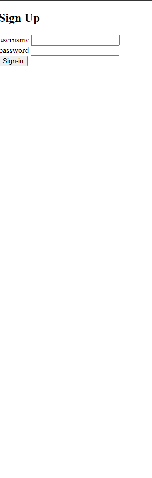

# Django Login/Signup Page

i have hosted it on python any-where you can check out it :- http://piyushraivds.pythonanywhere.com/
This is a simple login/signup page built with Django that allows users to sign up for an account, log in, and log out.

## Features

* User authentication with Django's built-in authentication system
* Sign up form with validation
* Login form with validation
* Logout functionality
* Option to upload photos and videos

## Tech Stack

* Django
* HTML
* CSS
* JavaScript

## Installation

1. Clone the project:

```
git clone https://github.com/your-username/django-login-signup.git
```

2. Create a virtual environment and activate it:

```
python -m venv env
source env/bin/activate
```

3. Install the requirements:

```
pip install -r requirements.txt
```

4. Run the Django server:

```
python manage.py runserver
```

5. Open your web browser and go to http://localhost:8000/login to see the login page.

## Screenshots

Here are some screenshots of the login/signup page:




## Contributors

This project was built by:

* Your Name (@piyushrai)


